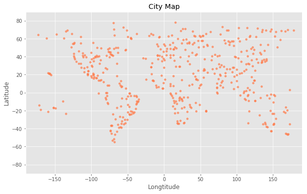
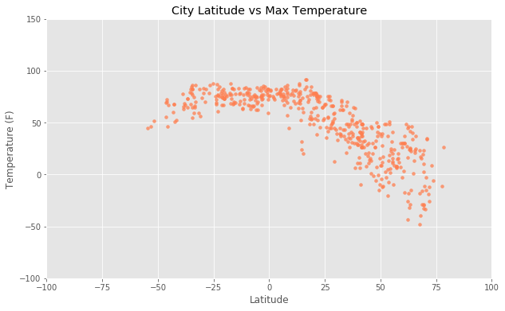
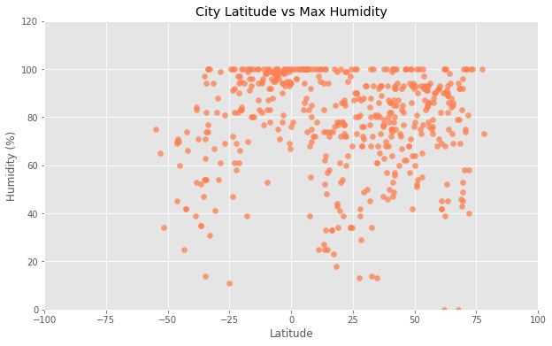
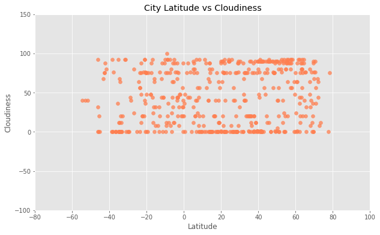
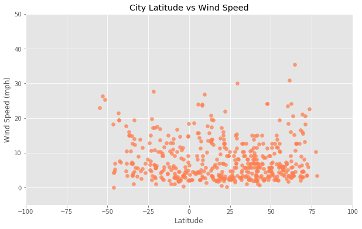

```python
# Dependencies
import csv
import matplotlib.pyplot as plt
import requests as req
import pandas as pd
import numpy as np
from citipy import citipy
import openweathermapy.core as owm #https://github.com/crazycapivara/openweathermapy
```


```python
# Save config information.
api_key = "a195057d622cf9c6c6a687d1e2a7f588"
settings = {"units": "imperial", "appid": api_key}

# Build partial query URL
# query_url = url + "appid=" + api_key + "&units=" + units + "&q="
```

# Define Functions to get City Name, Country Name, and Geocodes of a city


```python
def get_city(city):
    name = city.city_name
    return name
def get_country(city):
    country_code = city.country_code
    return country_code

def get_geocodes(location):
    global coordinates_tup
    try:
        data = owm.get_current(location, **settings)
        lat = data('coord.lat')
        lon = data('coord.lon')
        coordinates_tup = (lat, lon)
    except: # skip that city if error
        pass
    return coordinates_tup


```

# Generate 500 unique cities and geocodes


```python
coordinates = []
while (len(coordinates) < 500):
    lat = np.random.uniform(-90,90)
    lon = np.random.uniform(-180,180)
    city = citipy.nearest_city(lat, lon)
    city_name = get_city(city)
    country_code = get_country(city)
    geocode = get_geocodes(city_name)
    coordinates.append(geocode)
    coordinates = list(set(coordinates))


```

# Weather at 500 cities


```python
city_list = []
country_list = []
temp_max_list = []
lat_list = []
lon_list = []
humidity_list = []
clouds_list = []
wind_speed_list = []
for location in coordinates:
    data = owm.get_current(location, **settings)
    city_list.append(data('name'))
    country_list.append(data('sys.country'))
    temp_max_list.append(data('main.temp_max'))
    humidity_list.append(data('main.humidity'))
    clouds_list.append(data('clouds.all'))
    wind_speed_list.append(data('wind.speed'))
    lat_list.append(data('coord.lat'))
    lon_list.append(data('coord.lon'))
```


```python
data
```


    {'base': 'stations',
     'clouds': {'all': 24},
     'cod': 200,
     'coord': {'lat': 60.14, 'lon': -45.24},
     'dt': 1513987877,
     'id': 3421765,
     'main': {'grnd_level': 1002.4,
      'humidity': 93,
      'pressure': 1002.4,
      'sea_level': 1014.73,
      'temp': 30.31,
      'temp_max': 30.31,
      'temp_min': 30.31},
     'name': 'Nanortalik',
     'sys': {'country': 'GL',
      'message': 0.0409,
      'sunrise': 1514030716,
      'sunset': 1514051710},
     'weather': [{'description': 'few clouds',
       'icon': '02n',
       'id': 801,
       'main': 'Clouds'}],
     'wind': {'deg': 64.0048, 'speed': 23.42}}


# Create a DataFrame


```python
# Create a dataframe
city_data_df = pd.DataFrame({'City': city_list,
                            'Cloudiness': clouds_list,
                            'Country': country_list,
                            'Humidity': humidity_list,
                            'Lat': lat_list,
                            'Lon': lon_list,
                            'Max Temp': temp_max_list,
                            'Wind Speed': wind_speed_list})
city_data_df['Country'] = city_data_df['Country'].str.upper()
city_data_df['City'] = city_data_df['City'].str.title()
city_data_df.head()
```


<div>
<table border="1" class="dataframe">
  <thead>
    <tr style="text-align: right;">
      <th></th>
      <th>City</th>
      <th>Cloudiness</th>
      <th>Country</th>
      <th>Humidity</th>
      <th>Lat</th>
      <th>Lon</th>
      <th>Max Temp</th>
      <th>Wind Speed</th>
    </tr>
  </thead>
  <tbody>
    <tr>
      <th>0</th>
      <td>Alofi</td>
      <td>75</td>
      <td>NU</td>
      <td>94</td>
      <td>-19.06</td>
      <td>-169.92</td>
      <td>75.20</td>
      <td>10.29</td>
    </tr>
    <tr>
      <th>1</th>
      <td>Deputatskiy</td>
      <td>36</td>
      <td>RU</td>
      <td>53</td>
      <td>69.30</td>
      <td>139.90</td>
      <td>-32.34</td>
      <td>2.84</td>
    </tr>
    <tr>
      <th>2</th>
      <td>Londa</td>
      <td>0</td>
      <td>IN</td>
      <td>72</td>
      <td>15.34</td>
      <td>74.49</td>
      <td>59.96</td>
      <td>6.02</td>
    </tr>
    <tr>
      <th>3</th>
      <td>Navrongo</td>
      <td>0</td>
      <td>GH</td>
      <td>25</td>
      <td>10.89</td>
      <td>-1.09</td>
      <td>70.81</td>
      <td>10.16</td>
    </tr>
    <tr>
      <th>4</th>
      <td>Ostrovnoy</td>
      <td>8</td>
      <td>RU</td>
      <td>92</td>
      <td>68.05</td>
      <td>39.51</td>
      <td>16.99</td>
      <td>16.60</td>
    </tr>
  </tbody>
</table>
</div>


# Scatter Plots


```python
# Map
# Your objective is to build a series of scatter plots to showcase the following relationships:
y_axis = city_data_df['Lat']
# Temperature (F) vs. Latitude
x_axis = city_data_df['Lon']
size = 15

plt.figure(figsize=(10,6))
plt.scatter(x_axis, y_axis, marker = 'o', c = 'coral', alpha = 0.75, s=size)


plt.title("City Map")
plt.xlabel("Longtitude")
plt.ylabel("Latitude")

plt.style.use('ggplot')

plt.ylim(-90, 90)
plt.xlim(-190, 190)

plt.show()
```





```python
# Your objective is to build a series of scatter plots to showcase the following relationships:
x_axis = city_data_df['Lat']
# Temperature (F) vs. Latitude
y_axis_temp = city_data_df['Max Temp']
size = 15

plt.figure(figsize=(10,6))
plt.scatter(x_axis, y_axis_temp, marker = 'o', c = 'coral', alpha = 0.75, s = size)

plt.title("City Latitude vs Max Temperature")
plt.xlabel("Latitude")
plt.ylabel("Temperature (F)")

plt.style.use('ggplot')

plt.ylim(-100, 150)
plt.xlim(-100, 100)

plt.show()

```





```python
# Humidity (%) vs. Latitude
y_axis_humidity = city_data_df['Humidity']

plt.figure(figsize=(10,6))
plt.scatter(x_axis, y_axis_humidity, marker = 'o', c = 'coral', alpha = 0.75)

plt.title("City Latitude vs Max Humidity")
plt.xlabel("Latitude")
plt.ylabel("Humidity (%)")

plt.style.use('ggplot')

plt.ylim(0, 120)
plt.xlim(-100, 100)

plt.show()

```





```python
# Cloudiness (%) vs. Latitude
y_axis_cloud = city_data_df['Cloudiness']

plt.figure(figsize=(10,6))
plt.scatter(x_axis, y_axis_cloud, marker = 'o', c = 'coral', alpha = 0.75)

plt.title("City Latitude vs Cloudiness")
plt.xlabel("Latitude")
plt.ylabel("Cloudiness")

plt.style.use('ggplot')

plt.ylim(-100, 150)
plt.xlim(-80, 100)

plt.show()

```





```python
# Wind Speed (mph) vs. Latitude
y_axis_wind = city_data_df['Wind Speed']

plt.figure(figsize=(10,6))
plt.scatter(x_axis, y_axis_wind, marker = 'o', c = 'coral', alpha = 0.75)

plt.title("City Latitude vs Wind Speed")
plt.xlabel("Latitude")
plt.ylabel("Wind Speed (mph)")

plt.style.use('ggplot')

plt.ylim(-5, 50)
plt.xlim(-100, 100)

plt.show()
```





```python
city_data_df.to_csv('city_data.csv', sep='\t')
```
